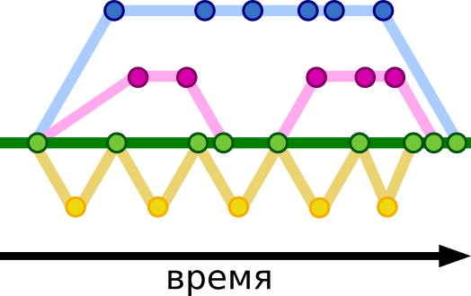

[<к содержанию](./readme.md)

# GIT. Ветвление и Методологии ветвления

## Ветвления

**Создание различных версий репозиториев, отличных друг от друга и называется ***ветвлением***.**

Схематически их работа может выглядеть так:

Кругами изображены точки-фиксации изменений в репозитории (коммиты)

Зелёная ветка — ветка программы, которая доступна пользователям.

В самом начале все разработчики начали работу с одной и той же версией репозитория, однако в последствии каждый вносит и фиксирует свои изменения, что приводит к появлению версии программы, отличной от других.

При этом, в дальнейшем, все изменения, созданные разработчиками, вносятся в общую ветку. Кажется, что создание отдельных веток в этом случае излишне, ведь каждый разработчик может производить написание кода и фиксацию изменений в локальном репозитории, а после вынести свои изменения в общую ветку.

Команды для работы с *ветками*:

**git branch [наименование]** — команда, которая создает новую ветку в репозитории.

**git checkout [наименование]** — команда, которая переключает вас на определенную ветку.

**git checkout -b [наименование]** — создаёт новую ветку и переключает вас на неё.

**git merge [наименование]** — поглощение. Вносит коммиты из другой ветки в текущую.

**git rebase[наименование]** — перебазирование. В этом случае коммиты вашей ветки накладываются поверх текущего состояния указанной ветки.

## Методологии ветвления

**Central Workflow** - Репозиторий содержит только одну главную ветку master. Все изменения комитятся в нее. Репозиторий может быть как локальным, так и удаленным. Подходит для одиночного проекта.

**Developer Branch Workflow** - У каждого разработчика есть своя личная ветка или несколько, в которые он вносит изменения. Все изменения, опубликованные в удаленном репозитории будут в этой ветке. Вся работа может быть выполнена на разных ветках, но потом должна будет слита (merged) в одну главную ветвь.

**Feature Branch Workflow** - репозиторий имеет второстепенную основную ветку (dev), в которой находится стабильный код для отправки пользователям. Фичи (функциональные ветки) начинают свой код от этой ветки и сливаются с ней.

**Issue Branch Workflow** - ветки создаются по задачам, поставленным перед разработчиками, а не по фичам, а каждая фича может состоять из нескольких отдельных задач

**Forking Workflow** - разработка ведется так, что есть два репозитория: оригинальный репозиторий, в который будут сливаться все изменения и Форк репозитория (это копия оригинального репозитория во владении другого разработчика, который хочет внести изменения в оригинальный).

**Github flow** - достаточно простая стратегия ветвления, которую можно описать несколькими правилами:

1. Код в master ветке должен быть работоспособным и готовым к развертыванию в любое время;
2. Все изменения производятся в отдельных ветках, созданных от master;
3. Когда изменение завершено, его проверяет руководитель команды и ещё один специалист;
4. После удачной проверки изменения его вливают в проект и немедленно разворачивают на сервере.

**Gitflow** - состоит из двух постоянных веток и нескольких типов временных веток. 

Постоянные 
- production (обычно — master) — стабильная ветка, доступная пользователям 
- develop — ветка для разработки. 

Временные
- feature — ветки, на которых разрабатывается новый функционал. При завершении работы над функционалом feature-ветки сливаются в develop;
- release — ветки, на которых идёт подготовка стабильного кода для публикации пользователям. По завершении работ по «стабилизации» кода, ветка сливается в production и develop;
- hotfix — ветки, служащие для быстрого решения критических проблем production. По завершении работ по решению ошибки, ветка сливается в production и develop.

*Данная модель подходит для организации рабочего процесса на основе релизов.*

[следующий раздел >](./conflikt.md)

##### Содержание: 
1. [Git - что это?](./what%20is%20it.md "Жми смелее")

2. [Основные операции](./basic%20operations.md "Кликни")

3. [Markdown. Синтаксис md](./markdown.md "Смелее")

4. [GitHub](./github.md)

5. [Файл .gitignore](./aboutgitignore.md)

6. [GIT. Ветвление и Методологии ветвления](./branch.md)

7. [GIT. Конфликты](./conflikt.md)

8. [GIT. Культура коммитов](./cultere%20commit.md)

9. [GIT. Форк](./fork.md)

10. [FAQ](./faq.md)