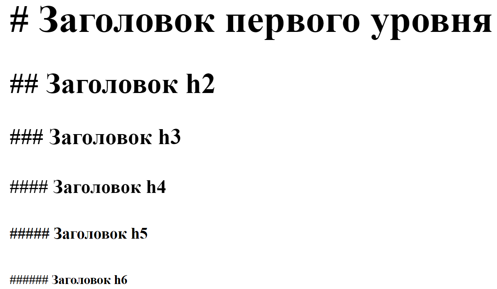
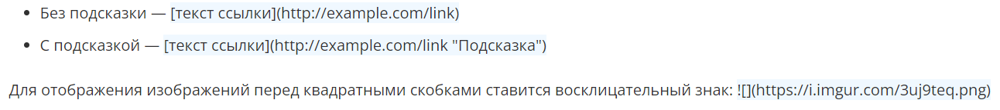

[<к содержанию](./readme.md)

# Markdown. Cинтаксис md

**Markdown** — простой и понятный язык разметки для оформления документации, который является упрощённой версией HTML. Файлы с разметкой Markdown имеют расширение md.

*Синтаксис:*

1. Пустая строка - разделение абзаца

2. Символом #  - отмечают заголовки в начале строки. Количеством символов отмечают уровень заголовка. Всего 6 уровней.Заголовок первого уровня h1 - #. Заголовок второго уровня h2 - ## и т.д. до 6-го уровня. Например:


3. Наклонное и полужирное начертание задаются при помощи * и _:
- Один символ для наклонного текста (_italic_, *italic*);
- Два символа для жирного текста (__strong__, **strong**);
- Три для наклонного и жирного одновременно (***жирный и наклонный***).

4. Ссылки создаются комбинацией квадратных и круглых скобок:


5. Создание нумерованных списков
-  Для разметки ненумерованных списков можно использовать или *, или -, или +, или всё сразу — результат будет один: 
```bush=
   + элемент 1
   - элемент 2
   * элемент ...
```
- Вложенные пункты создаются двойным пробелом перед маркером пункта:
```bush=
* элемент 
  * вложенный элемент 2.1
  * вложенный элемент 2.2
  ```
- Для разметки нумерованных списков ставится положительное число с точкой:
```bush=
2. элемент 1
3. элемент 2
   1. элемент 3
   99. элемент 3
4. элемент 4
```

6. Для ограждения программного кода используется обратный апостроф ` :
- Одинарный парный — для вставки небольшого участка кода в текст;
- Двойной парный — для вставки небольшого участка кода, содержащего одинарный апостроф в тексте;
- Тройной парный (или вместо обратного апострофа — тильда) — для вставки блока программного кода.

7. Для оформления цитат используется знак «больше» >: `> Цитируемый текст`

[следующий раздел >](./github.md)

##### Содержание: 
1. [Git - что это?](./what%20is%20it.md "Жми смелее")

2. [Основные операции](./basic%20operations.md "Кликни")

3. [Markdown. Синтаксис md](./markdown.md "Смелее")

4. [GitHub](./github.md)

5. [Файл .gitignore](./aboutgitignore.md)

6. [GIT. Ветвление и Методологии ветвления](./branch.md)

7. [GIT. Конфликты](./conflikt.md)

8. [GIT. Культура коммитов](./cultere%20commit.md)

9. [GIT. Форк](./fork.md)

10. [FAQ](./faq.md)